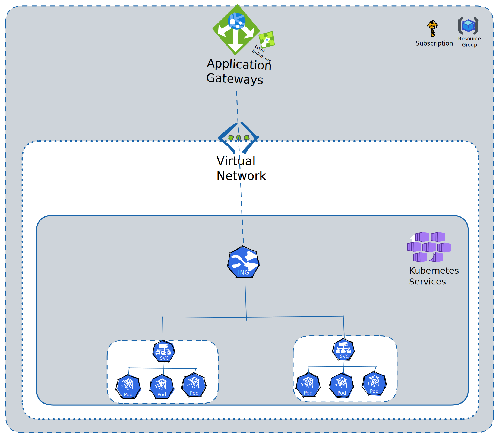
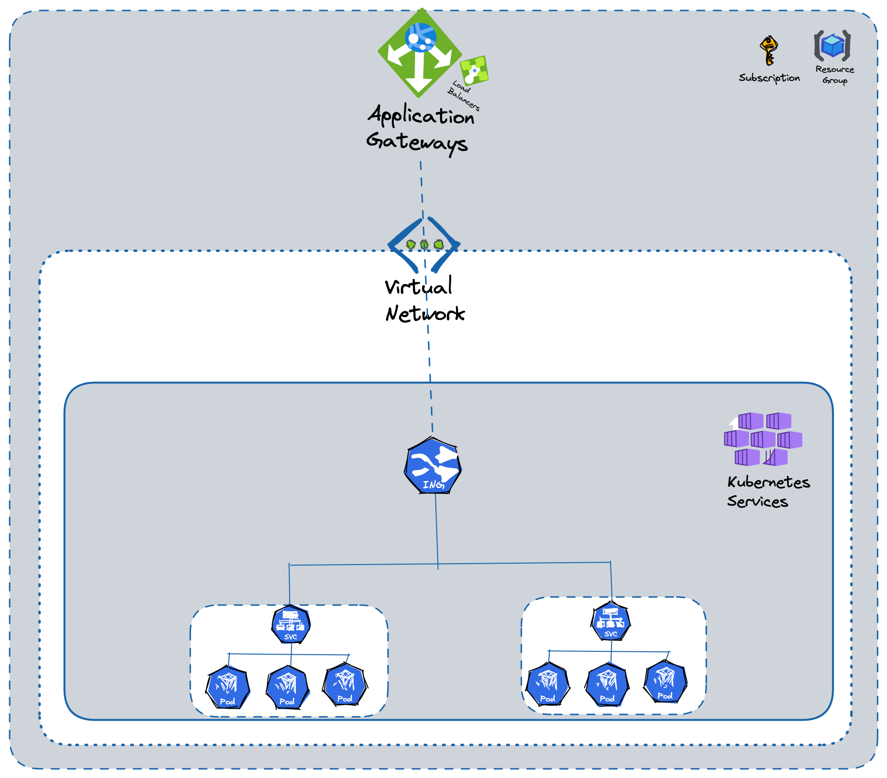
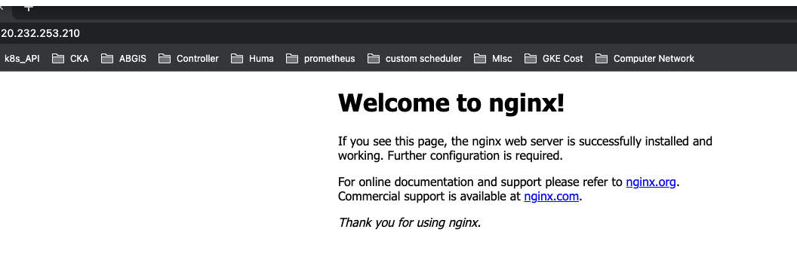
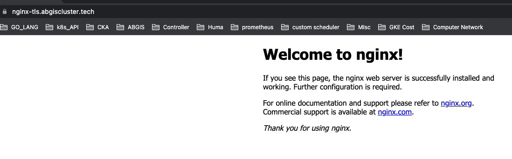

## Interacting With Applications in AKS using AGIC(Azure Application Gateway Ingress Controller)

### Description

- Will create an architecture that will allow to access the applications 
  behind Application Gateway in Azure.
- Applications will be running on AKS (Azure Kubernetes Service)
- AKS will be running in a private subnet that can not be accessed from outside.

### Steps to Follow

- Create a VNet in Azure under your subscription.
- Create a subnet for AKS, you can create this subnet while creating the
  cluster as well.
- Once cluster is created use the network option in cluster to enable the
  Application Gateway add-on.
- Once add-on is enabled, you will see an application gateway created with a public IP.
- You can use this public IP to point to your domain.
- expose your services with the help of kubernetes ingress.

### Broad Architecture and Various Components





#### Deploy An Application on AKS

- Deploying a nginx pod for the testing purpose

```yaml
apiVersion: apps/v1
kind: Deployment
metadata:
  name: nginx-deployment
spec:
  selector:
    matchLabels:
      app: nginx
  replicas: 2 # tells deployment to run 2 pods matching the template
  template:
    metadata:
      labels:
        app: nginx
    spec:
      containers:
        - name: nginx
          image: nginx:1.14.2
          ports:
            - containerPort: 80
```

- Expose this service, I have used below command directly to expose this app.

```text
kubectl expose deploy nginx-deployment --name nginx
```

- Above command will create a service.

```text
NAME         TYPE        CLUSTER-IP   EXTERNAL-IP   PORT(S)   AGE
nginx        ClusterIP   None         <none>        80/TCP    17h
```

- Now I want to expose this service to outer world using the Azure Application
  Gateway Ingress Controller.
- Here we are going to expose this service via HTTP and HTTPS.
- for **HTTP** create an ingress with below specs.

```yaml
apiVersion: networking.k8s.io/v1
kind: Ingress
metadata:
  name: nginx
  annotations:
    kubernetes.io/ingress.class: azure/application-gateway
spec:
  rules:
  - http:
      paths:
      - pathType: Prefix
        path: /
        backend:
          service:
            name: nginx
            port:
              number: 80
```

- The above manifest will create ingress like this.

```yaml
NAME        CLASS    HOSTS                         ADDRESS          PORTS     AGE
nginx       <none>   *                             20.232.253.210   80        4s
```

- Here we have not mentioned any host options but that can also be done in the ingress
  manifest, we will see this when we create ingress with HTTPS.
- Now you should be able to access nginx on `20.232.253.210`



- Now for **HTTPS**, will have to add some more steps/
- Create a secret with your domain certificate and key.
- In my case I am going to use `nginx-tls.abgiscluster.tech` to access the app via HTTPS.
- I don't have a valid certificate, but it doesn't matter for the purpose of this article.
- Create certificate.

```yaml
kubectl create secret tls server-cert --cert server.crt --key server.key
```

- Create ingress with the cert info and your host info.

```yaml
apiVersion: networking.k8s.io/v1
kind: Ingress
metadata:
  name: nginx-tls
  annotations:
    kubernetes.io/ingress.class: azure/application-gateway
spec:
  tls:
    - secretName: server-cert
      hosts:
      - nginx-tls.abgiscluster.tech
  rules:
  - host: nginx-tls.abgiscluster.tech
    http:
      paths:
      - pathType: Prefix
        path: /
        backend:
          service:
            name: nginx
            port:
              number: 80
```

- Above manifest will create an ingress with port 80 and 443.

```text
NAME        CLASS    HOSTS                         ADDRESS          PORTS     AGE
nginx-tls   <none>   nginx-tls.abgiscluster.tech   20.232.253.210   80, 443   62m
```

- Now you can access your application on nginx-tls.abgiscluster.tech in secure manner.
- I am using self-signed certificate.


